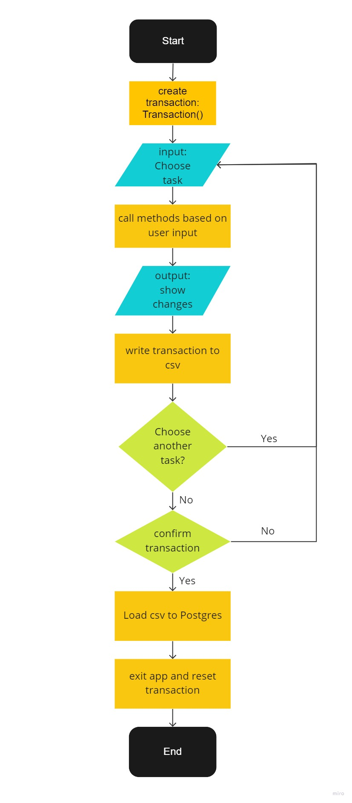

# Project – Cashier CLI Based App
## Table of Contents
- [Project – Cashier CLI Based App](#project--cashier-cli-based-app)
  - [Table of Contents](#table-of-contents)
  - [Background](#background)
  - [Library \& Tools](#library--tools)
  - [Installation](#installation)
  - [Flowchart](#flowchart)
  - [Overview](#overview)
    - [1. transaction.py](#1-transactionpy)
      - [1.1. Choice class](#11-choice-class)
      - [1.2. Transaction class](#12-transaction-class)
        - [1.2.1 Helper Methods:](#121-helper-methods)
        - [1.2.2 Primary Methods](#122-primary-methods)
    - [2. database.py](#2-databasepy)
      - [2.1. ReadAndWrite class](#21-readandwrite-class)
      - [2.2. SendToPostgreSQL class](#22-sendtopostgresql-class)
      - [3. main.py](#3-mainpy)

## Background
This is a CLI based application that serves as a cashier to track transactions. It is meant to be used as a self service for customers to use when they are about to pay their orders.    

The project consists of three main files: transaction.py, database.py, and main.py. 
1. **transaction.py**, contains two classes: 
   - Choice: related to user input ;
   - Transaction: use case controlling the core rule
2. **database.py**, contains two classes:
   - ReadAndWrite: read and write related to the transaction file (.csv); 
   - SendToPostgreSQL: database adapter to PostgreSQL 
3. **main.py**: mainly used to confirm the transaction, instantiating classes, and controlling the user input.
<hr>

## Library & Tools
1. Necessary:
   - pandas
   - psycopg2-binary
2. Python 3.10.5
3. Database: PostgreSQL
<hr>

## Installation
1. <a href="https://docs.github.com/en/repositories/creating-and-managing-repositories/cloning-a-repository" target="_blank">Clone the repository</a>
2. <a href="https://packaging.python.org/en/latest/guides/installing-using-pip-and-virtual-environments/" target="_blank">Create an environment</a>
3. Install the required packages, or just use `pip install -r requirements.txt`
4. Create db_variables.py to store the database connection variables (USER, PASSWORD, HOST, PORT, DATABASE)
5. Create a database and a table: use `create_db.sql`
6. Run `py -m create-stage-file.py` to create a staging file
7. Run app: `py main.py`  

<hr>

## Flowchart


First, start the app by running `py main.py`. This will create the transaction object and will prompts the user for an input on what task the user wants to execute. The available commands are: add new item, update item properties, remove item, reset transaction, check order, calculate the total price, check (display) the order, confirm, and exit.<br>
If the command is related to the transaction, it will update the changes or write the entries to the staging file. *More on the details of each command later*.
After each command finishes, it will return back to the main menu and ask the user for a new task. To display the order, select check order and total price to show the total bill.<br>
Each transaction need to be confirmed to finish. To exit the app, select "10" and this will automatically reset the transaction and load the data from the staging file to PostgreSQL. <br>     
<hr>

## Overview
### 1. transaction.py
#### 1.1. Choice class
The Choice class is a utility class that provides methods for getting user input and validating it. The Choice class has several methods that allow the user to enter different types of input, such as a string, integer, or float. These methods ensure that the input is of the correct data type and handle any errors that may occur during the conversion process.

The Choice class also has several methods for specific types of user input, such as product names, quantities, and prices. These methods provide a more user-friendly interface for entering these values, by prompting the user for the specific type of input and handling any errors that may occur.

In summary, the Choice class provides a convenient and user-friendly way of getting and validating user input for the transaction management system.

The Choice class defines methods for prompting the user for input and returning the input as a specific data type. These methods include:

- **get_user_input()**: This method prompts the user for input and validates that the input is of the specified data type. If the input is not valid, the method displays an error message and prompts the user for input again.

- **get_product_name()**: This method prompts the user for a product name and returns the user's input as a string.

- **get_product_quantity()**: This method prompts the user for a product quantity and returns the user's input as an integer.

- **get_product_price()**: This method prompts the user for a product price and returns the user's input as a float.

- **choice_add_item()**: This method prompts the user for a product name, quantity, and price, and returns a list containing the user's input for each of these values.

- **choice_update_item_name()**: This method prompts the user for a product name and a new product name, and returns a list containing the user's input for each of these values.

- **choice_update_item_quantity()**: This method prompts the user for a product name and a new product quantity, and returns a list containing the user's input for each of these values.

- **choice_update_item_price()**: This method prompts the user for a product name and a new price, and returns a list containing the user's input for each of these values.


#### 1.2. Transaction class

The Transaction class contains methods that are related to a transaction. This class has the following attributes:

- `file_path`: This is the file path for the transaction file. It is used by the methods that refer to the transaction file.

- `__init__(self)`: This is the constructor method that is called when a Transaction object is instantiated. It sets the `file_path` attribute to the path of the transaction file.

##### 1.2.1 Helper Methods:
There are several helper methods in the Transaction class. These methods perform specific tasks that are used by other methods in the class. These helper methods are used by other methods in the Transaction class to perform specific tasks related to transactions, such as checking for the existence of a product, reading the transaction from a file, or exporting the transaction to a file. Some examples of helper methods in the Transaction class are:

- **read_csv()**: This method reads the transaction file and returns the transaction data as a Pandas DataFrame object.

- **to_csv()**: This method exports the transaction data to the transaction file as a CSV. It takes a Pandas DataFrame object containing the transaction data as a parameter and saves the data to the transaction file.

- **product_exists()**: This method checks whether a product with a given name exists in a transaction. It takes a single argument, the name of the product, and returns a boolean value indicating whether the product exists in the transaction. The method first reads the transaction from the CSV file using the `read_csv` method. It then checks if the product exists in the transaction by checking if its name is in the list of item names in the transaction. If the product exists, the method returns `True`, otherwise it returns `False`.

- **product_not_exists()**: This method checks whether a product with a given name does not exist in a transaction. It takes a single argument, the name of the product, and returns a boolean value indicating whether the product does not exist in the transaction. The method uses the product_exists method to check if the product exists in the transaction. If the product exists, the method returns `False`, otherwise it returns `True`.

- **check_product_list()**: This method takes a dataframe containing transaction data as input and checks whether the dataframe is empty. It does this by using the `df.item_name.notnull().any()` to check if the **item_name** column of the dataframe contains any non-null values. If the item_name column contains any non-null values, the `check_product_list` method returns True, indicating that the transaction data is not empty and contains at least one item. If the item_name column contains only null values, the `check_product_list` method returns `False`, indicating that the transaction data is empty and does not contain any items.

- **drop_nulls()**: This method takes a dataframe containing transaction data as input and removes all null values from the dataframe. The `drop_nulls` method uses the `df.dropna()` method to remove all rows or columns from the dataframe that contain null values. After removing all null values from the dataframe, the `drop_nulls` method returns the modified dataframe without any null values. This modified dataframe can then be used in other methods to perform calculations on the transaction data without having to worry about null values. The `drop_nulls` method is typically used to ensure that calculations are performed accurately and reliably on the transaction data. 

- **update_name()**: This method updates the name of an existing item in the transaction. It prompts the user for the current product name and the new product name, and then passes these values to the `choice.choice_update_item_name` method to get the user's input. It then updates the item's name in the transaction file using the `update_value` method.

- **update_quantity()**: This method updates the quantity of an existing item in the transaction. It prompts the user for the product name and the new quantity, and then passes these values to the choice.choice_update_item_quantity method to get the user's input. It then updates the item's quantity in the transaction file using the read_and_write.update_item_quantity method.

- **update_price()**: This method updates the price of an existing item in the transaction. It prompts the user for the product name and the new price, and then passes these values to the `choice.choice_update_item_price` method to get the user's input. It then updates the item's price.

- **check_order()**: This method prints the current transaction to the user. It uses the `read_csv` method to read the transaction file and then prints the contents of the file to the user.
  
- **reset_transaction()**: This method resets the transaction by removing all items from the transaction file.

- **discount()**: The discount method is a function that takes a total price as input and returns a discount rate based on the value of the total price. The discount method compares the total price to a set of predetermined ranges, and it returns a different discount rate depending on which range the total price falls into. ***For example***, if the total price is greater than 200,000 and less than or equal to 300,000, the discount method will return a discount rate of 0.95, indicating that a discount of 5% should be applied.

- **total_price()**: This method calculates the total price of the current transaction. It uses the self.read_csv method to read the transaction file and then calculates the total price of all items in the transaction. It then prints the total price to the user.

##### 1.2.2 Primary Methods
The primary methods in the Transaction class are the methods that define the core functionality of the class. These methods are the main methods that allow you to perform actions related to transactions, such as adding, updating, or removing items from a transaction. Some examples of primary methods in the Transaction class are:

- **add_item()**: This method adds a new item to the transaction. It prompts the user for the product name, quantity, and price, and then passes these values to the `choice.choice_add_item` method to get the user's input. It then adds the item to the transaction file using the `read_and_write.write_values` method.

- **update_value()**: This method allows to update a value in a transaction. It takes three arguments: the name of the item to be updated, the name of the column to be updated, and the new value for the column. It then updates the value in the transaction and returns the updated transaction. This is used to replace the new values in `update_name`, `update_quantity`, and `update_price`.  

- **remove_item()**: This method removes an item from the transaction. It prompts the user for the product name and then uses the `choice.get_product_name` method to get the user's input. It then removes the item from the transaction file using the `remove_item` method.  
<hr>

### 2. database.py

The `database.py` file is a module that contains code for interacting with a database. This code may define classes and methods that make it easier to connect to a database, execute SQL queries, and handle errors that may be raised by the database driver. The exact details of what the code does will depend on the implementation, but it is designed to provide a convenient and abstracted way to access and manipulate data in a database from within the code. By using the classes and methods defined in the `database.py` file, you can interact with the database without having to worry about the details of establishing connections, executing queries, and handling errors. In this project, the database adapter is using psycopg2 connected to PostgreSQL. The database can be changed depending on the requirements.

#### 2.1. ReadAndWrite class
ReadAndWrite class that defines methods for reading from and writing to a CSV file. It has two methods: `write_header` and `write_values`. The `write_header` method creates a new file if one does not exist and writes the CSV header to the file. The `write_values` method appends data to the file as a new row. Both methods include error-handling code to handle potential exceptions that may be raised during these operations, such as a *FileNotFoundError* if the file does not exist or a *PermissionError* if the program does not have permission to write to the file. The ReadAndWrite class provides a convenient way to read from and write to a CSV file within the code. It abstracts the details of opening and closing the file, writing data to it, and handling errors, allowing you to focus on the data itself.

#### 2.2. SendToPostgreSQL class
SendToPostgreSQL class defines a method for loading data from a CSV file into a PostgreSQL database. The `csv_to_postgresql` method establishes a connection to the database using the `psycopg2` library, creates a cursor, and uses the `copy_from` method to copy the data from the file into the database. This method also includes error-handling code to handle exceptions that may be raised during these operations, such as a `psycopg2`.Error if there is a problem with the connection or a *FileNotFoundError* if the file does not exist. The *SendToDatabasePostgreSQL* class provides a convenient way to transfer data from a CSV file to a PostgreSQL database within the code. It abstracts the details of establishing connections, executing SQL queries, and handling errors, allowing you to focus on the data itself.
<hr>

#### 3. main.py
The `main.py` file is the entry point for the application. It defines the `main_menu` function, which provides a menu of options for managing transactions. When the user selects an option, the `main_menu` function calls the corresponding method from the Transaction or ReadAndWrite classes to perform the desired action. For example, if the user selects **option 1**, the `main_menu` function will call the `add_item` method of the Transaction class to add a new item to the current transaction. To exit the program, the user must select option 10 from the main menu. This will call the `reset_transaction` method of the `Transaction` class to reset the current transaction, and then call the `exit_application` function from the sys module to exit the program.

The `main_menu` function also includes error-handling code to validate the user's input and handle any exceptions that may be raised by the selected function. For example, if the user enters an invalid menu option or if there is a problem loading data from the CSV file into the PostgreSQL database, the `main_menu` function will display an error message and return to the main menu without performing the selected operation.

The `main_menu` function also contains the logic for calling the `confirm_payment` function, which prompts the user to confirm the transaction and then loads the transaction data from the CSV file into a PostgreSQL database.

The code also defines a `main_menu` function, which provides the user with a menu of options for managing transactions. The user can choose from the following options:

1. Add a new item
2. Update an item's name
3. Update an item's quantity
4. Update an item's price
5. Remove an item
6. Reset the transaction
7. Check the order
8. Calculate the total price
9. Confirm the transaction
10. Exit the application
    
Each menu option corresponds to a specific method from the `Transaction` or `ReadAndWrite` classes. When the user selects a menu option, the corresponding method is called and the results are displayed to the user.

The code also defines a `confirm_payment` function, which prompts the user to confirm the transaction and then loads the transaction data from the CSV file into a PostgreSQL database.

To use the code, you will need to create a `db_variables.py` file that contains the following variables:
```
USER = "<your_user_name>"
PASSWORD = "<your_password>"
HOST = "<your_host>"
PORT = "<your_port>"
DATABASE = "<your_database>"
```

In order to run the `main.py` file, you will need to have the required Python packages installed and have created the db_variables.py file. You can install the required packages using the `pip install -r requirements.txt` command, where `requirements.txt` is a file containing a list of the required packages.


Once you have installed the required packages and created the `db_variables.py` file, you can run the code by calling the `main_menu` function from the terminal in the directory where the `main.py` file is located. To do this, enter the following command:

You can run the `main.py` file by calling the `python main.py` command in the terminal. This will execute the `main_menu` function and display the menu of options for managing transactions. You can then follow the prompts to select an option and perform the corresponding action.

Alternatively, you can also run the code by calling the `main_menu` function directly from the terminal. To do this, open the terminal in the directory where the `main.py` file is located, and enter the following command:
```
python -c "from main import main_menu; main_menu()"
```
This will execute the `main_menu` function and display the menu of options for managing transactions. 

